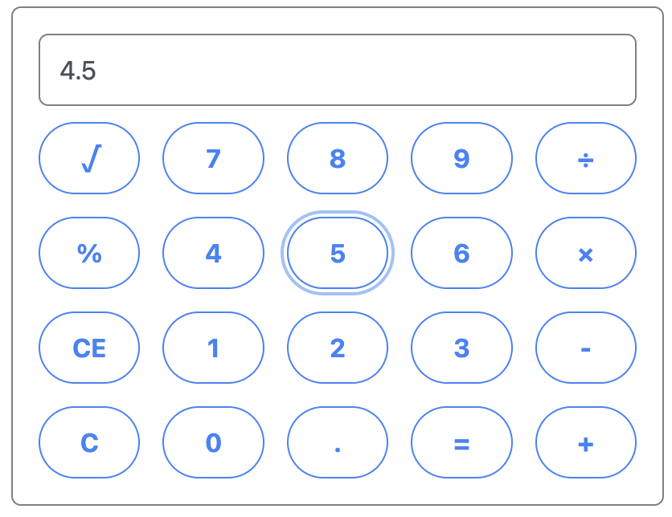

Start Frontend

```
cd frontend
yarn start
```

Start Backend

```
dotnet run
```

## Todo List

1. Adding items to the list saves them in memory to the backend.
   

2. Pressing Edit button allows changing of item, on confirm saves to memory in the backend.
   

3. Delete button removes item from list and removes from memory on backend.
   

Data is fetched from the backend when page is reloaded.

Ideally would be saving to database, may implement at a later time.

## Calculator

Basic calculator with addition, subtraction, mulitplication, division, percentage and square root.

Example: 500 x 4.5 - 6 = 2244





